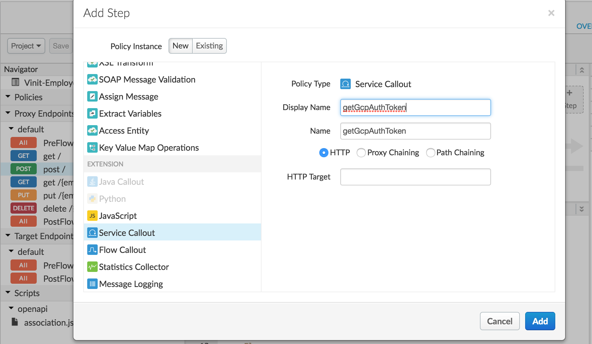
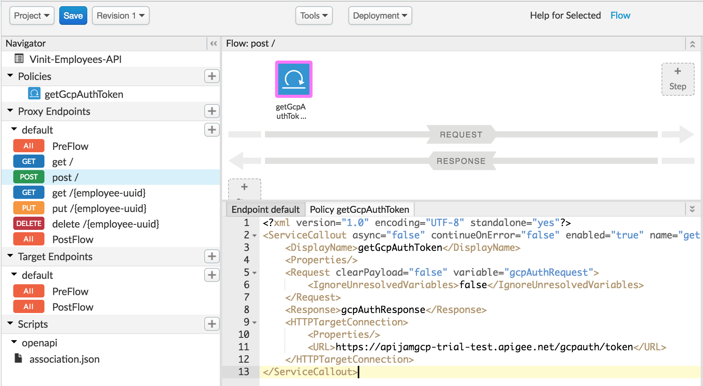
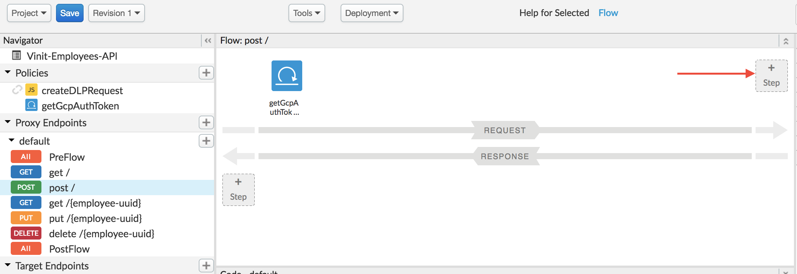
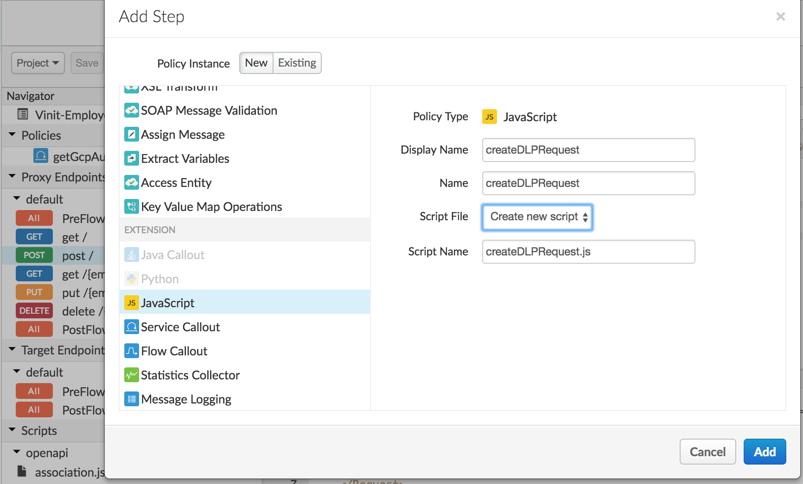
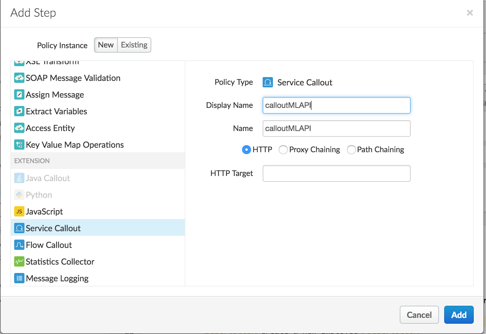
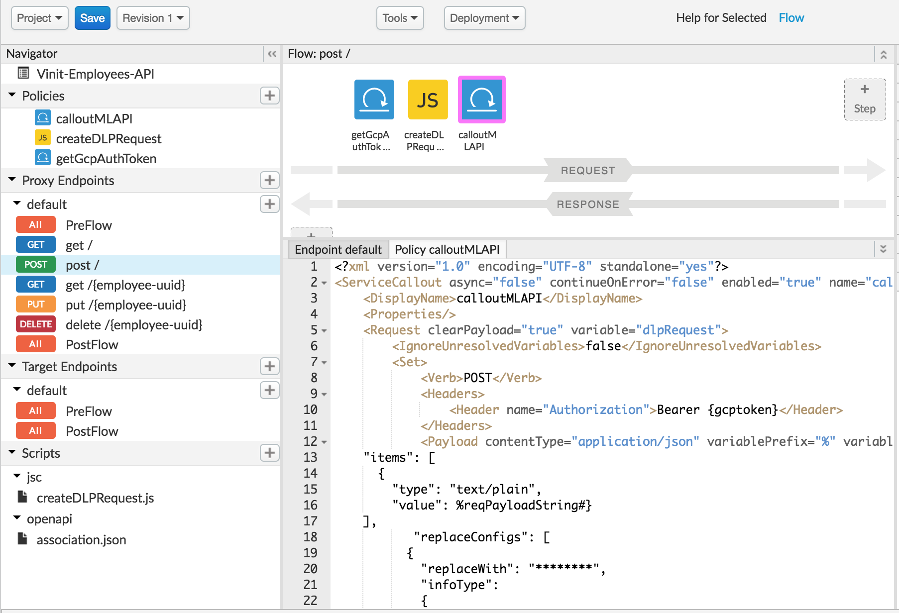
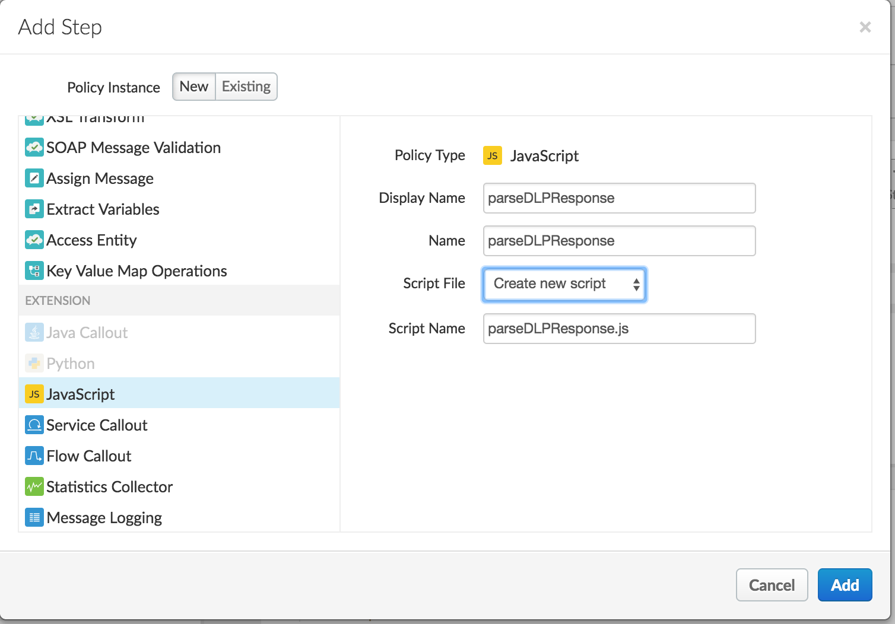
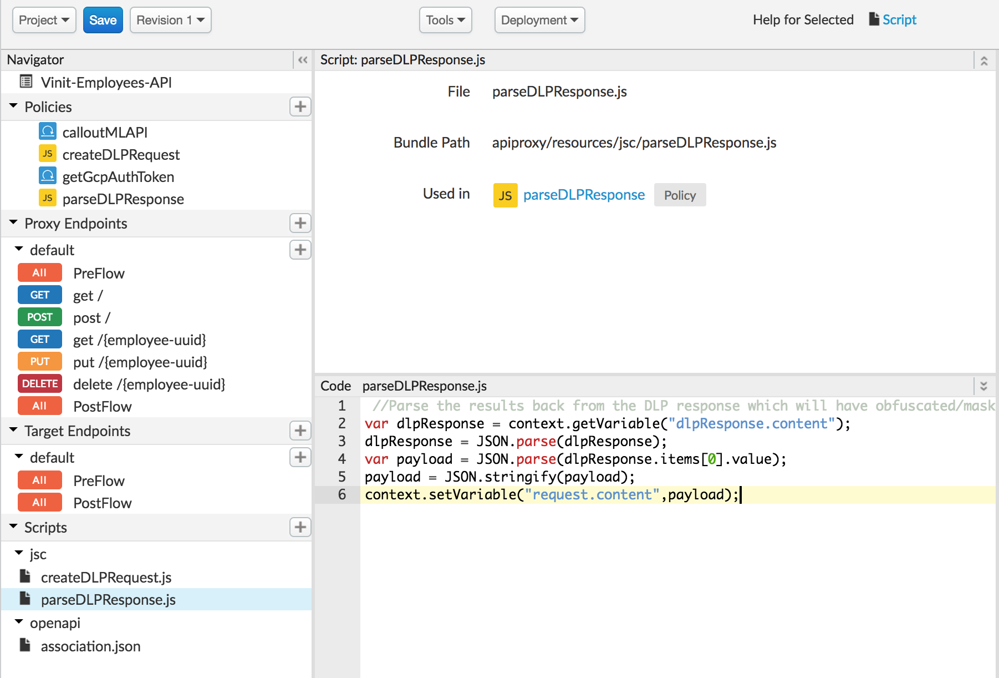
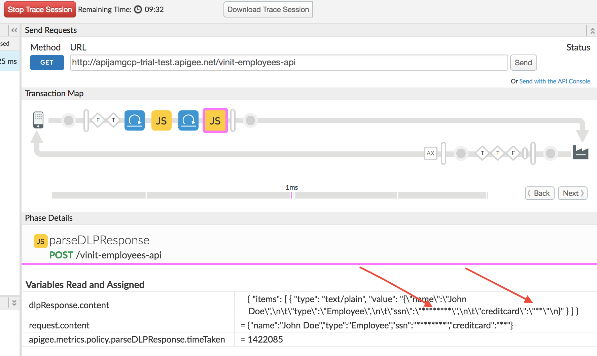

# API Development : Add the power of Google's Machine Learning to APIs

*Duration : 30 mins*

*Persona : API Team*

# Use case

Accelerate development of innovative, API-based applications by leveraging Google Cloud Platform (GCP) **Machine Learning APIs**.

Core idea is to power a range of new API-based features designed to accelerate innovation in organizations and industries that are at risk of disruption. GCP Machine Learning APIs would directly integrate with Edge adding the ML functionalities and features to an API call. ML APIs enable Apigee users to enhance their APIs by leveraging GCP ML capabilities such as Data Loss Prevention (DLP), Natural Language Processing (NLP), and Vision APIs. This would enable the the API teams to rapidly create innovative, secure, scalable and robust HTTP APIs that harness the power of GCP Machine Learning capabilities. 


**About Google Machine Learning:**
Google Cloud's AI provides modern machine learning services, with pre-trained models and a service to generate your own tailored models. Neural net-based ML service has better training performance and increased accuracy compared to other large scale deep learning systems. These services are fast, scalable and easy to use. Major Google applications use Cloud machine learning, including Photos (image search), the Google app (voice search), Translate, and Inbox (Smart Reply). 

*Details for **Data Loss Prevention APIs** can be found here:  https://cloud.google.com/dlp/
*Details for **Natural Language APIs** can be found here:  https://cloud.google.com/natural-language/
*Details for **Vision APIs** can be found here:  https://cloud.google.com/vision/
*Details for **everything Machine Learning** and more: https://cloud.google.com/products/machine-learning/


# How can we add ML to the APIs running through Apigee Edge?
In this lab we will exactly see how we would do that. Many of the ML APIs have an http endpoint which can be invoked from Edge using something like a **service callout policy**. For other Machine Learning features which might require some libraries in node.js, java etc..can also be run natively in the Edge platform. In this lab we will use the Data Loss Prevention API which can be invoked using a simple service callout policy.


# Pre-requisites

* An existing API proxy.

# Instructions

## Select existing Employees API

1. Go to [https://apigee.com/edge](https://apigee.com/edge) and log in. This is the Edge management UI. 

2. Select **Develop → API Proxies** in the side navigation menu.


3. Click on the proxy you created before and click on the flow for the "POST" method.


## We now need to get a valid token to invoke the ML(DLP) API Use a Service Callout Policy

4. Add the policy from the conditional POST flow.





5. Modify the policy to reflect a request with the appropriate query parameters for the API that will grant a valid token to invoke the ML APIs.

```
<?xml version="1.0" encoding="UTF-8" standalone="yes"?>
<ServiceCallout async="false" continueOnError="false" enabled="true" name="getGcpAuthToken">
    <DisplayName>getGcpAuthToken</DisplayName>
    <Properties/>
    <Request clearPayload="false" variable="gcpAuthRequest">
        <IgnoreUnresolvedVariables>false</IgnoreUnresolvedVariables>
    </Request>
    <Response>gcpAuthResponse</Response>
    <HTTPTargetConnection>
        <Properties/>
        <URL>https://apijamgcp-trial-test.apigee.net/gcpauth/token</URL>
    </HTTPTargetConnection>
</ServiceCallout>

```

As you can see we have provisioned an endpoint for this lab that will return you a valid token authorizing you to make the ML API calls to GCP. Note that this is a service account provisioned only for this lab. In future you can think of this step replaced by some kind of a similar orchestration to retrieve a valid auth token against your own GCP accounts.
We are fetching an auth response and storing it in a variable named **gcpAuthResponse** which we will use in the next step to extract the token.

## Prepare the request body for invoking the ML API

1. Click on **+ Step** and add a policy right next to the previous one.



Scroll down the policy list and select **Java script**



Then click on **Add** button.

2. Update the java script file under resources with the below snippet of code.


```
// fetch the original payload and set to a context variable
 var reqPayloadString = JSON.stringify(context.getVariable("request.content"));
 context.setVariable("reqPayloadString",reqPayloadString);
 
 //extract the token from the previous callout to GCP auth and set it to a variable
 var gcpAuthResponse = JSON.parse(context.getVariable("gcpAuthResponse.content"));
 var gcptoken = gcpAuthResponse.token;
 context.setVariable("gcptoken",gcptoken);
```

In a nutshell the above javascript simply extracts the token parsing through the response form the auth endpoint and prepares the request for the actual DLP ML API call.

* **Save** the API Proxy.

## Invoke the DLP ML API using the service callout policy passing the token extracted from the above step.

3. Click on **+ Step**


Scroll down the policy list and select **Extract Variables** and update the default display name to **Extract Geocodes**




Then click on **Add**.

4. Update the policy with the below code snippet

```
<?xml version="1.0" encoding="UTF-8" standalone="yes"?>
<ServiceCallout async="false" continueOnError="false" enabled="true" name="calloutMLAPI">
    <DisplayName>calloutMLAPI</DisplayName>
    <Properties/>
    <Request clearPayload="true" variable="dlpRequest">
        <IgnoreUnresolvedVariables>false</IgnoreUnresolvedVariables>
        <Set>
            <Verb>POST</Verb>
            <Headers>
                <Header name="Authorization">Bearer {gcptoken}</Header>
            </Headers>
            <Payload contentType="application/json" variablePrefix="%" variableSuffix="#">{
    "items": [
      {
        "type": "text/plain",
        "value": %reqPayloadString#}
    ],
           "replaceConfigs": [
          {
            "replaceWith": "********",
            "infoType":
            {
              "name": "US_SOCIAL_SECURITY_NUMBER"
            }
          },
          {
           "replaceWith": "*********", 
            "infoType":
            {
              "name": "CREDIT_CARD_NUMBER"
            }
          }
        ]
  }</Payload>
        </Set>
    </Request>
    <Response>dlpResponse</Response>
    <HTTPTargetConnection>
        <Properties/>
        <URL>https://dlp.googleapis.com/v2beta1/content:redact</URL>
    </HTTPTargetConnection>
</ServiceCallout>
```

Here's a brief description of the elements that were modified in this policy. You can read more about the GCP DLP Endpoint here (https://cloud.google.com/dlp/docs/reference/rest/)

As you can see we are setting the auth Bearer token as a header as "**gcptoken**".
In the payload we are passing the configuration as to which data types are considered to be sensitive which will be identified by the DLP ML API and **obfuscated** for the downstream form that point.
In the above case we are telling the ML API to identify any fields that might match to someones **Credit Card Number and/or SSN**.

* Save the API Proxy.

## Extract the results of the DLP ML API which would have obfuscated sensitive data and send the protected data to the backend.

5. Click on **+ Step**


Scroll down the policy list and select **Javascript** and update the default display name to **parseDLPResponse** select *Create New Script* and then name it **parseDLPResponse.js**



6. Select the newly created script file and add the following code:



```
 //Parse the results back from the DLP response which will have obfuscated/masked data for the sentitive fields and downstream it towards the backend
var dlpResponse = context.getVariable("dlpResponse.content");
dlpResponse = JSON.parse(dlpResponse);
var payload = JSON.parse(dlpResponse.items[0].value);
payload = JSON.stringify(payload);
context.setVariable("request.content",payload);
```

In this javascript we are parsing through the response from the DLP API which would now have identified the sensitive data and obfuscated it. We will now send that data over to the backend systems and thus inturn protecting the loss of sensitive information blocking it before it made any further into your systems.

* Save the API Proxy.


## Testing the API Proxy with the location query after deploying changes

* Click on the **Save** button to save and deploy the changes to the API Proxy.


*  Go to the **Trace** tab and start a trace session by clicking the *Start Trace Session* button.

Make a POST call to the employees API and send some payload like the below - 
```
{
    "name":"John Doe",
    "type":"Employee",
    "ssn":"457-55-5462",
    "creditcard":"4111111111111111"
}

```




As you can see above how using the DLP ML API we can protect sensitive information through and from our systems.

