# External Logging : Integrating with Stackdriver 

*Duration : 20 mins*

*Persona : API Team / Security*

# Use case

You have a requirement to log data to a central monitoring tool. [Google Stackdriver](https://cloud.google.com/stackdriver) provides powerful monitoring, logging, and diagnostics. It equips you with insight into the health, performance, and availability of cloud-powered applications, enabling you to find and fix issues faster. It is natively integrated with Google Cloud Platform, Amazon Web Services, and popular open source packages. Stackdriver provides a wide variety of metrics, dashboards, alerting, log management, reporting, and tracing capabilities.

# How can Apigee Edge help?

By exposing an API through Apigee Edge, you gain the ability to log data to [Google Stackdriver](https://cloud.google.com/stackdriver) using out-of-the-box policies. Edge's Service Callout policy enables you to enhance your API with remote logging features to centrally monitor your APIs without requiring you to write any code or to modify any backend services.

In this lab we will see how to use an out-of-the-box remote callout policy, "Service Callout", to remotely log to [Google Stackdriver](https://cloud.google.com/stackdriver). A Service Callout policy can be used by an API proxy to make additional calls to remote systems during the processing of a proxy flow.

# Pre-requisites

Apigee Edge API Proxy created in earlier lab exercise. If not, jump back to "API Design - Create a Reverse Proxy with OpenAPI specification" lab.

# Instructions

* Go to [https://apigee.com/edge](https://apigee.com/edge) and log in. This is the Edge management UI. 

* Select **Develop → API Proxies** in the side navigation menu.


* Click on **{your_initials}**_employee_proxy that you have created in earlier lab exercise.


* Click on **Develop** tab to access API Proxy development dashboard.

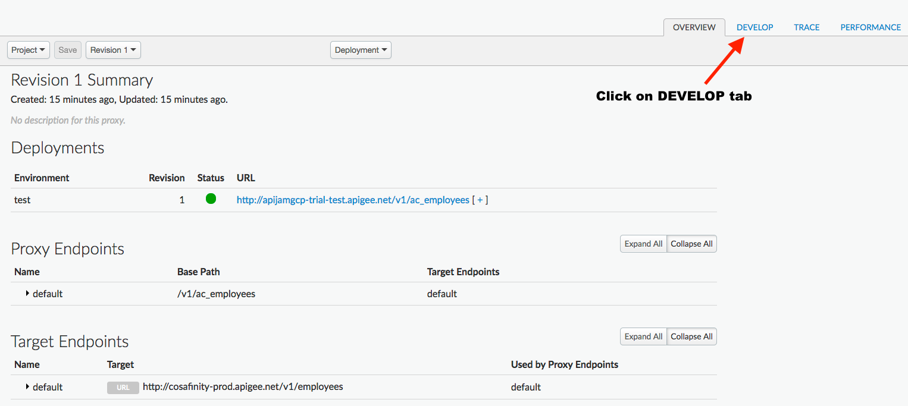

* Click on **PostFlow** under Proxy Endpoint default.

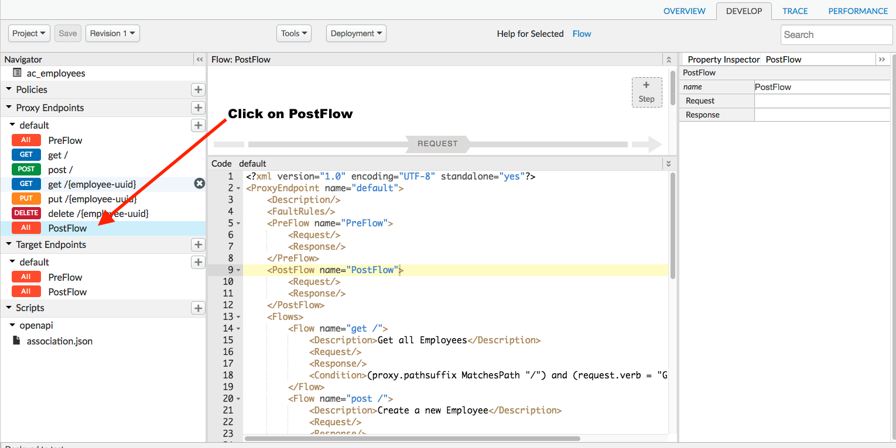

* Click on **+Step** on the bottom of the Response flow to attach a ServiceCallout policy. (You may have to adjust the window panels to see it.)

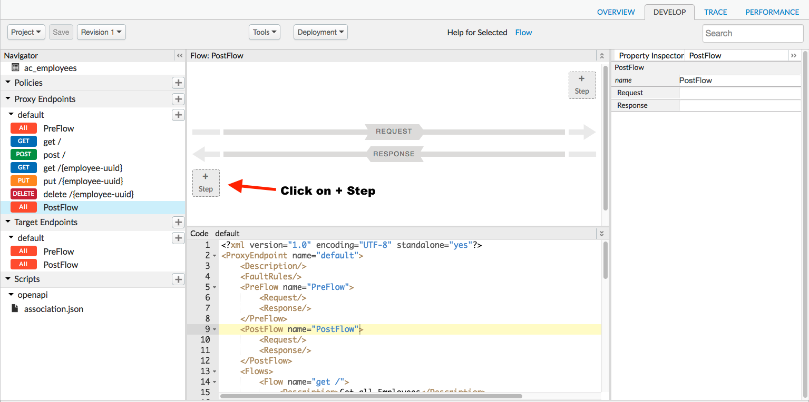

* Select **Service Callout Policy**. Rename it to **getGcpAuthToken**. Add the **HTTP Target** url supplied by your instructor. Click on **Add** button to add the Service Callout policy to proxy endpoint postflow request.

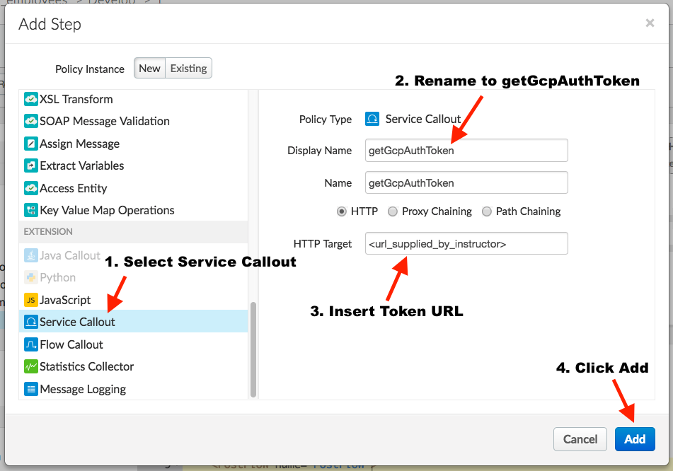

* Notice the Service Callout policy icon below the Response flow that shows exactly where the policy is attached, along with the policy XML configuration below in the editor.

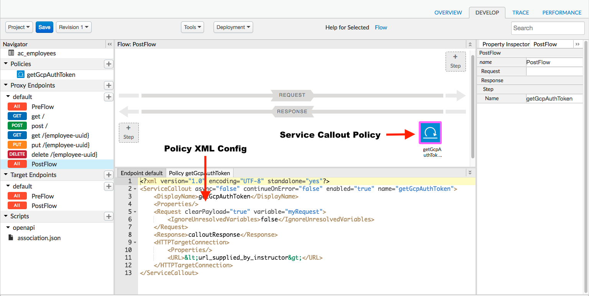

* Change the Request 'variable' to **gcpAuthRequest** and the body of Response to **gcpAuthResponse** in the Policy XML configuration.

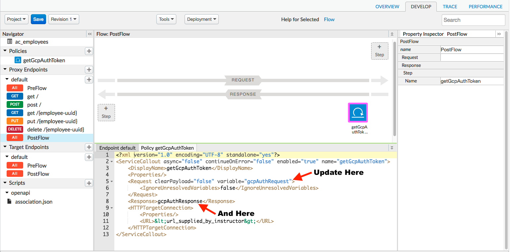

* Click on **Save** to save the API Proxy changes.

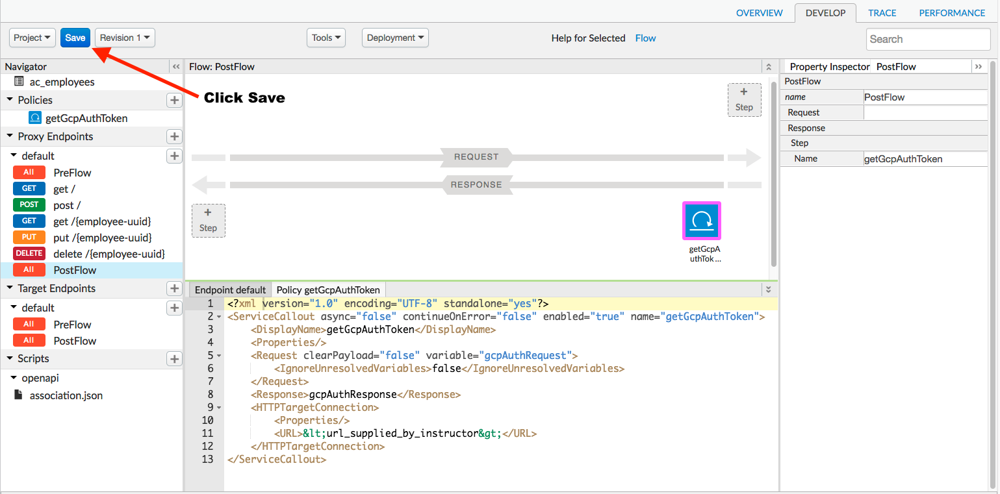

* Now we are going to parse the token out of the JSON response.  Make sure you are on the PostFlow, then click on **+Step** on the bottom of the Response flow to attach a JavaScript policy.

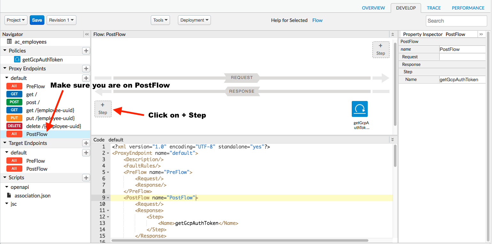

* Select the **JavaScript** policy.  Rename it to **parseGcpAuthToken**.  Choose **Create new script**.  Change the Script Name to **parseGcpAuthToken.js**. Click on the **Add** button.

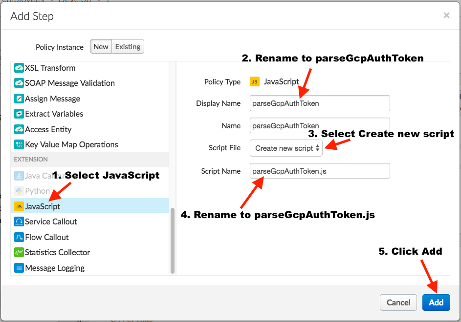

* Select the **parseGcpAuthToken.js** script in the bottom left pane.

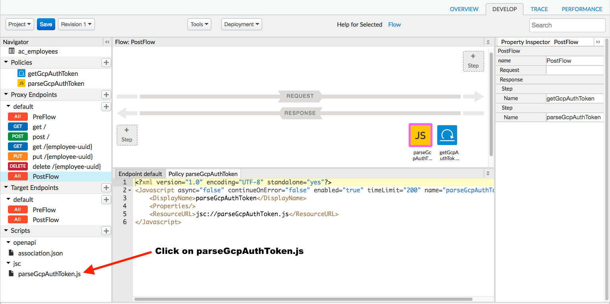

* Add the following JavaScript code to **parseGcpAuthToken.js**, then Click **Save**.

```
//extract the token from the previous callout to GCP auth and set it to a variable
var gcpAuthResponse = JSON.parse(context.getVariable("gcpAuthResponse.content"));
var gcptoken = gcpAuthResponse.token;
context.setVariable("gcptoken",gcptoken);
```

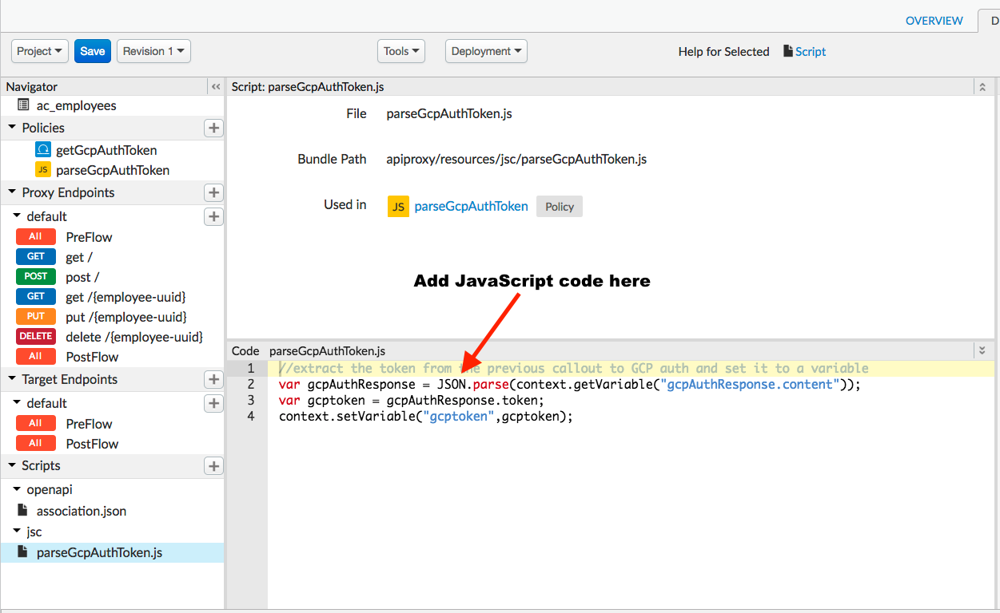

* Next, we are going to add another Service Callout to log to StackDriver. Verify you are on the PostFlow, then click on **+ Step** on the Response flow.

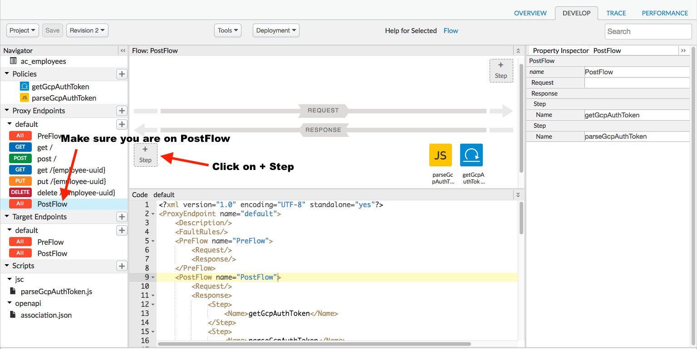

* Select the **Service Callout** policy. Rename it to **Log-To-Stackdriver**. Set the HTTP Target to **https://logging.googleapis.com/v2/entries:write**. Click **Add**.

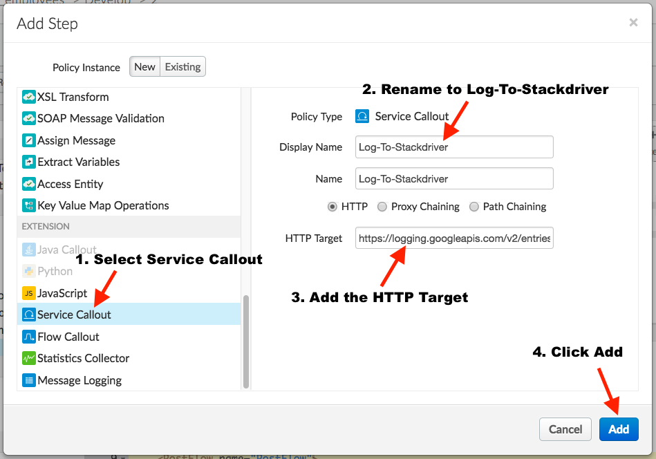 

* Overwrite the Log-To-Stackdriver policy with the following configuration.  **Note: Replace the indicated portion of the payload with your first name.**
```
<?xml version="1.0" encoding="UTF-8" standalone="yes"?>
<ServiceCallout name="Log-To-Stackdriver">
    <Request>
        <Set>
            <Headers>
                <Header name="authorization">Bearer {gcptoken}</Header>
            </Headers>
            <Payload contentType="application/json">{
  "logName": "projects/apigee-apijam-gcp/logs/syslog",
  "resource" : {
    "type": "api",
    "labels": {}
  },
  "labels": {
      "flavor": "test"
  },
  "entries": [{
      "severity" : "INFO",
      "textPayload" : "*add your first name here* called the {apiproxy.name} proxy with VERB of {request.verb}"
     }
  ],
  "partialSuccess": true
}
            </Payload>
            <Verb>POST</Verb>
        </Set>
    </Request>
    <Response>logResponse</Response>
    <HTTPTargetConnection>
        <Properties>
            <Property name="success.codes">2xx, 3xx</Property>
        </Properties>
        <URL>https://logging.googleapis.com/v2/entries:write</URL>
    </HTTPTargetConnection>
</ServiceCallout>
```

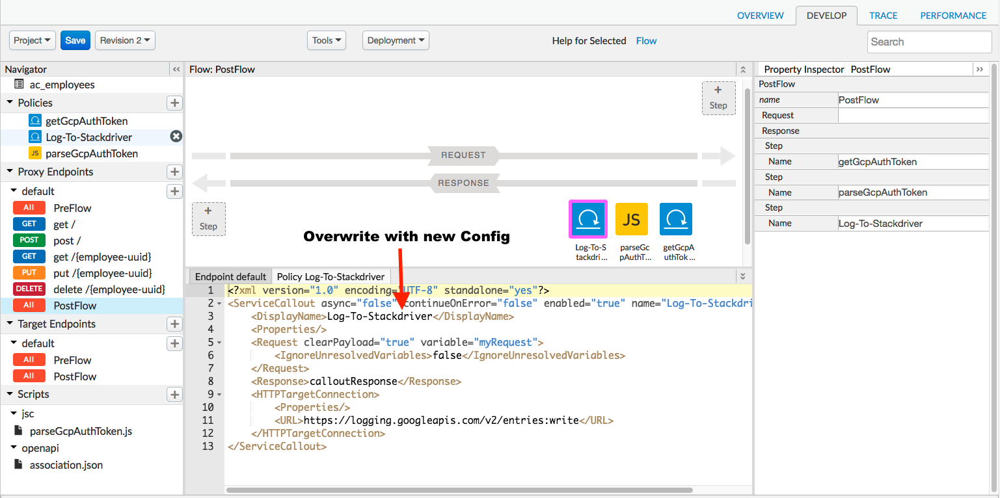

* After updating the payload with your name, click **Save**.

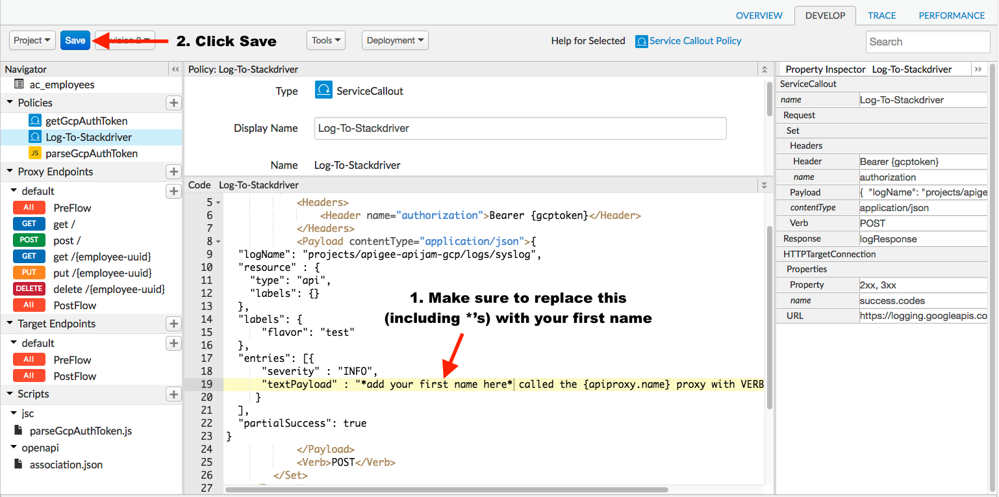

* Now, let's test the updated API proxy using the Trace Console. Click on **Trace** tab.

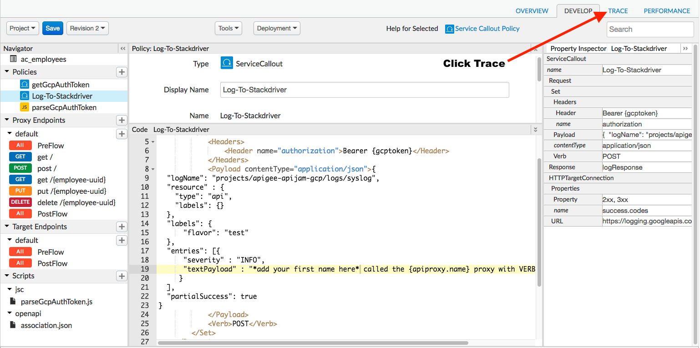

* Click on **Start Trace Session** to see API Proxy with Stackdriver logging in action.

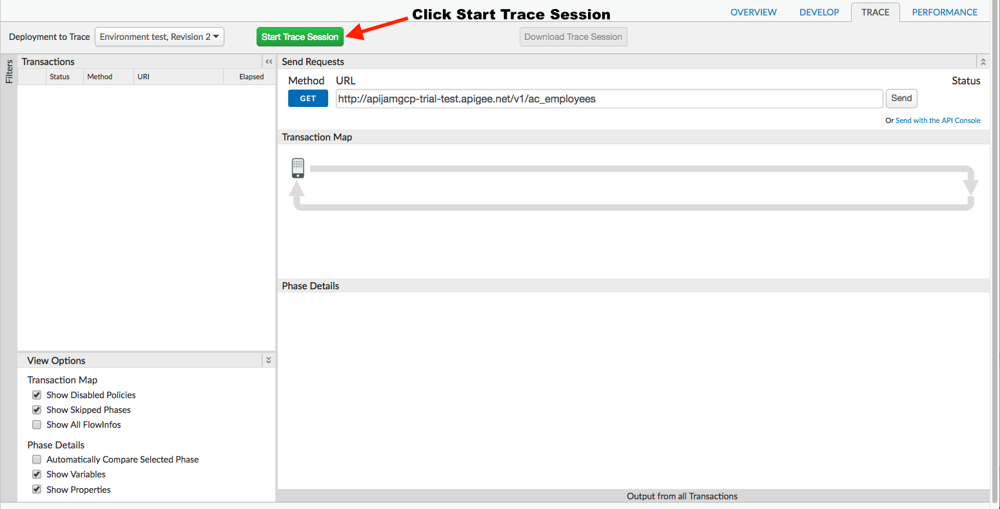

* Click on **Send** button.

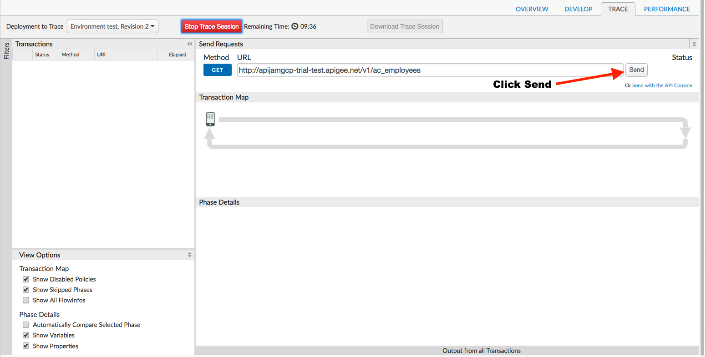

* You will see a 200 response code indicating a successful call. Click on the second Service Callout (the one on the left).  Scroll down to see the details of the callout.

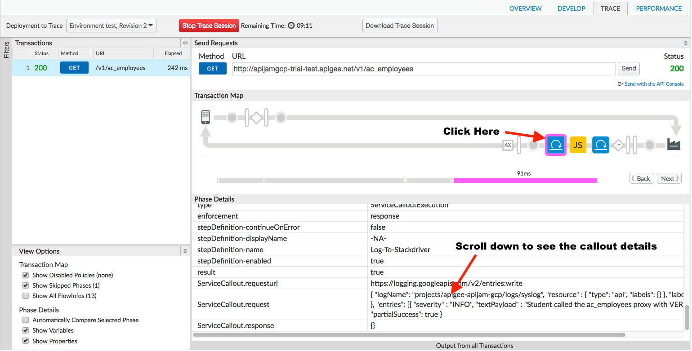

* You should now see your log entry show up in the instructor's Stackdriver console.


* *Congratulations!*...You have now completed creating a proxy that logs to [Google Stackdriver](https://cloud.google.com/stackdriver).

# Lab Video

If you like to learn by watching, we'll be adding a video soon.

# Earn Extra-points

You may have noticed the method we used to call StackDriver is synchronous.  Can you think of a way to invoke the call in an asynchronous fashion?  Hint:  Think about the JavaScript policy...

# Quiz

1.

2.

# Summary

That completes this hands-on lesson. In this lab you learned how to remotely log to [Google Stackdriver](https://cloud.google.com/stackdriver).

# References

* Useful Apigee documentation links on the policies we used  - 

    * [Service Callout Policy](http://docs.apigee.com/api-services/reference/service-callout-policy) 

    * [JavaScript Policy](http://docs.apigee.com/api-services/reference/javascript-policy)

# Rate this lab

How did you like this lab? Rate [here (Coming Soon)](https://goo.gl/forms/).
